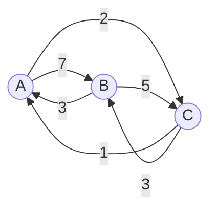
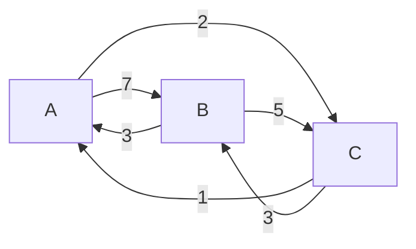
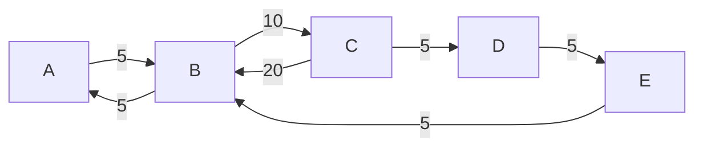

最近感悟

有些事情自己不接触到是不会相信的，比如系统API不稳定，尤其是write read。有一些歌开源代码我就不说是谁了，系统接口永远默认成功我操

关键是定位问题的盲点也在这里，永远不会去考虑系统的错误，而是查业务自身有没有问题。导致白白浪费时间。在不靠谱的代码上堆叠出来的业务，又咋可能靠谱

<!-- more -->

## rocksdb最后一层的compact问题

最近和sue讨论rockdb值得记录一下:

如果周期性的反复删除重写一组key，这组key最终会落在最后一层，而最后一层的compact调度是比较晚的，最后一层也不参加score计算compact，所以需要主动触发compact来把这种key删除掉

这也是为什么myrocks会有针对delete的计数配置的原因

```
     rocksdb_compaction_sequential_deletes   0
     rocksdb_compaction_sequential_deletes_count_sd  O
     rocksdb_compaction_sequential_deletes_file_size 0
     rocksdb_compaction_sequential_deletes_window    0
```

类似Pika也有一个计数 https://github.com/OpenAtomFoundation/pika/blob/2f71d18ad81fa01e3239e5f8d70dea5b3694ff3d/src/storage/src/redis_hashes.cc#L272

```cpp
  s = db_->Write(default_write_options_, &batch);
  UpdateSpecificKeyStatistics(key.ToString(), statistic);
  return s;
```
原子的。性能太差，我之前改过一个版本直接删了。还是有可取之处的，不过用atomic太扯里。应该thread_local counter


rocksdb的代码，搜

```c++
kBottommostFiles
LevelCompactionBuilder::SetupInitialFiles()
```

就能看到了

## [Erasure Coding versus Tail Latency](https://brooker.co.za/blog/2023/01/06/erasure.html)

backup request是发两次选最快的一次么，总之这种可以降低延迟

发两次，选一次，发M次，选N(`N<M`)次，我操，纠删码的原理，感觉是这种发两次的拓展情况

所以就存在一种用法，一个对象分K个，r个冗余，从K+r里读k个就行了

我操，EC-Cache！重大发现！不好意思，有人想到了https://zhuanlan.zhihu.com/p/24713081 他妈的

当然这种玩法肯定是能降低延迟的，就是得改造

## [Postgres: The Graph Database You Didn&#39;t Know You Had](https://www.dylanpaulus.com/posts/postgres-is-a-graph-database)

```sql
CREATE TABLE nodes (
  id SERIAL PRIMARY KEY,
  data VARCHAR(255)
);
CREATE TABLE edges (
  previous_node INTEGER REFERENCES nodes(id),
  next_node INTEGER REFERENCES nodes(id),
  PRIMARY KEY (previous_node, next_node)
);
```

第一张表是节点，第二张表是第一张表的id和关联

查询依赖

```sql
SELECT id, data
FROM nodes
JOIN edges ON nodes.id = edges.next_node
WHERE edges.previous_node = 1;
```

查id为1 的相邻节点

如果复杂点，查id为1 点相邻节点的相邻节点呢？递归了

用PG特殊功能 WITH RECURSIVE

```sql
WITH RECURSIVE friend_of_friend AS (
  SELECT edges.next_node
  FROM edges
  WHERE edges.previous_node = 1
  UNION
  SELECT edges.next_node
  FROM edges
  JOIN friend_of_friend ON edges.previous_node = friend_of_friend.next_node
)
SELECT nodes.data
FROM nodes
JOIN friend_of_friend ON nodes.id = friend_of_friend.next_node;
```

WITH RECURSIVE语法

```sql
WITH RECURSIVE {name} AS (
  {base case}
  UNION
  {recursive case}
)
```

## [Hive数据导出的几种方式](https://www.cnblogs.com/sheng-sjk/p/13940642.html)

我以为select *会很快，但是不如直接导出HDFS文件。离谱

```sql

# 1
insert overwrite directory '/home/data/' select * from hive_table;

# 2
insert overwrite local directory '/home/data/' select * from hive_table

row format delimited fields terminated by ‘\t’  #字段间用\t分割

stored as textfile;   #导出文件的存储格式为textfile
```

```shell
export table hive_table to '/home/data/';
```

这和上面一样


## [一种基于DAG的MapReduce调度算法](https://www.jsjkx.com/CN/article/openArticlePDF.jsp?id=1319)

节点主动申请任务代替调度器自身调度。

如何根据DAG排序？说了个向上排序，但是评估数据怎么算的？都没说

## 数据本地性感知的 MapReduce负载均衡策略

基于hash分片，一般来说，数据不会不均匀，如果遇到数据倾斜怎么办，这里就是提前采样，判定每个分片数据规模，然后调度的时候拆分一下。

采样一般来说都有，但是基本都是装装样子，没用上


## [Introducing Compute-Compute Separation for Real-Time Analytics](https://rockset.com/blog/introducing-compute-compute-separation/)


数据导入到ingest节点，ingest生成数据，然后ingest节点复制同步到线上query节点

回顾一下离线导入逻辑，一般都是有个mapreduce系统spark之类，生成线上的数据，sst文件，上传到对象存储，然后db端从对象存储里下载，ingest导入

rockset本身是集成对象存储的，那还拐弯干啥？直接写到对象存储，然后复制一份到SSD，上线，这也就是ingest节点的作用，query节点直接共享SSD，切一个snapshot的功夫

本质上是把MapReduce直接生成的这个步骤放到线上集群的节点来处理了

离线导入的场景，不能满足流式的场景，这种设计，流式的导入也是没问题的

另外，能省掉中间产物上传下载的时间/开销

这种设计query节点也能无限扩

这里有详细的讨论 https://rockset.com/blog/tech-overview-compute-compute-separation/


这个图更明确一些


## [Offline Is Just Online With Extreme Latency](https://blog.jim-nielsen.com/2023/offline-is-online-with-extreme-latency/)

幽默


## [So, You Want To Build A DBaaS](https://matt.blwt.io/post/so-you-want-to-build-a-dbaas/)

优势在哪里？稳定性？能解决什么问题？上限在哪里？能不能可量化可预测性能？单机能力怎么样？做到最优了么？能覆盖大部分应用场景么？你的最大优势在哪里？

述职呢搁着

## Hekaton: SQL Server's Memory-Optimized OLTP Engine


```txt

索引管理

所有支持MVCC的DBMSs都将版本数据和索引数据分开存储。我们可以将索引看作KV键值对，键是被索引的数据行中的字段值（例如ID），值是索引对应的数据行的指针。

主键索引的情况比较简单，因为主键（同时也是索引的Key）是保持不变的，索引的Value总是指向版本数据链的起点，比如在InnoDB中，主键索引的数据行就是指向主表的。在主键索引中，索引的键值对指针会发生什么样的变更，取决于DBMS使用了哪种的数据存储方式。

对于Delta存储，我们上面讨论过，主表永远都是存的master版本数据，它是原地更新的，因此在更新数据时，主表中的数据行位置不发生改变，因此索引Value的指针也没有发生改变。

对于Append-only的存储，版本数据链有两种不同的方向：

    O2N，新的版本数据Append在版本链的末端，因此索引的Value指针始终指向链表的起点不变；只有在发生GC的时候才会调整指针地址
    N2O，每当产生新版本时，都需要调整索引值的指针，此时DBMS一般会在索引上进行DELETE & INSERT的操作完成调整

对于辅助索引，被索引的字段值（同时也是索引中的Key）可能改变，索引的Value指向的版本数据也有可能改变。因此有不同的方案对索引中的指针进行管理。
Logical Pointers

最常用的方案是建立一层中间表，让索引的Value能够一直不变，例如指向主键。这种方案也是InnoDB在使用的，所以我们通常说辅助索引会包含被索引值以及主键值。通过主键值将索引中的指针固定下来，这样每当版本数据链表起点发生改变时，只需要同时更新主键值对应的指针。虽然只有一个辅助索引时，听起来改动的复杂度是相同的，都是改变了1处指针，但是当有许多辅助索引时，就会是O(1) vs. O(n)的差异了。

借助主键的坏处是辅助索引的体积会随着主键体积发生变化，另一个方案是为逻辑tuple提供64-bit的唯一ID。实际上思路并没有区别，都是在物理版本链和索引之间增加了一层映射，只是看映射的内容如何选取一个唯一固定、节约空间的值。
Physical Pointers

Uber曾经发过一篇文章：《Why Uber Engineering Switched from Postgres to MySQL》，实际上他们并不是一开始就在用Postgres。Uber最早使用的也是MySQL，中途招了一些热衷于Postgres的工程师，所以他们就从MySQL切到了Postgres。他们在表中加了非常多的辅助索引，在使用过程中发现，Postgres的辅助索引是指向磁盘中的版本链起点的，在版本链起点发生变动时，多个辅助索引的指针就要发生修改。在Append-only的存储方式下，这种设计的好处是没有通过中间层映射（例如主键ID）回表查询，坏处也非常明显，当辅助索引非常多的时候，版本数据链起点的变更将会导致所有辅助索引的指针都需要更新。

目前还有一些DBMS使用了这种方案，例如MemSQL、Hekaton。如果Uber的工程师有读过这篇论文，他们可能可以节约不少的迁移成本。

```

另外[The Part of PostgreSQL We Hate the Most](https://ottertune.com/blog/the-part-of-postgresql-we-hate-the-most/)

> Most DBMSs, including Oracle and MySQL, implement N2O. But PostgreSQL stands alone in using O2N 
> (except for Microsoft’s In-Memory OLTP engine for SQL Server).

数据膨胀问题，不及时compact搜索性能差，另外对于这种场景，也有优化，索引分裂？总之空间换时间

##  如何保存一个用户的完整操作数据？


比如微博用户的所有微博，音乐用户的所有播放记录，尤其是音乐，每天的数据有可能上千条

- 自己拼一个list表结构，metadata和list数据，list按照长度拆成段

## linux系统监控到大量的 TCP 连接建连时被重置，如何快速定位到是哪个进程造成的？

ss排除

bpf
```shell
#!/bin/env bpftrace

kprobe:tcp_connect {
	$sk = (struct sock *)arg0;
	@socks[$sk] = pid;
}

kprobe:tcp_reset {
	$sk = (struct sock *)arg0;
	printf("%d recv tcp_reset\n", @socks[$sk]);
	delete(@socks[$sk]);
}

kprobe:tcp_close {
	$sk = (struct sock *)arg0;
	delete(@socks[$sk]);
}
```

## [使用PSI（Pressure Stall Information）监控服务器资源](https://cloud.tencent.com/developer/news/841752)

除了oomd，没见别的应用用这玩意啊 
https://github.com/facebookincubator/oomd/

https://github.com/performancecopilot/pcp 这个也用了
‘
https://github.com/openbmc/openbmc/blob/1d3ca46bd63f8e32a18f2ece930eab86e8f7a18d/poky/bitbake/lib/bb/runqueue.py#L174 这个也用了
```cpp
#include <errno.h>
#include <fcntl.h>
#include <stdio.h>
#include <poll.h>
#include <string.h>
#include <unistd.h>

int main() {
      const char trig[] = "some 500000 1000000";
      struct pollfd fds;
      int n;

      fds.fd = open("/proc/pressure/io", O_RDWR | O_NONBLOCK);
      if (fds.fd < 0) {
              printf("/proc/pressure/io open error: %s\n",
                      strerror(errno));
              return 1;
      }
      fds.events = POLLPRI;

      if (write(fds.fd, trig, strlen(trig) + 1) < 0) {
              printf("/proc/pressure/io write error: %s\n",
                      strerror(errno));
              return 1;
      }

      printf("waiting for events...\n");
      while (1) {
              n = poll(&fds, 1, -1);
              if (n < 0) {
                      printf("poll error: %s\n", strerror(errno));
                      return 1;
              }
              if (fds.revents & POLLERR) {
                      printf("got POLLERR, event source is gone\n");
                      return 0;
              }
              if (fds.revents & POLLPRI) {
                      printf("event triggered!\n");
              } else {
                      printf("unknown event received: 0x%x\n", fds.revents);
                      return 1;
              }
      }

      return 0;
}
```

挺有意思

## [OceanBase 4.1解读：给用户足够灵活简单的IO隔离体验](https://zhuanlan.zhihu.com/p/625066808)


有人问：资源隔离尤其是磁盘 IO 隔离，有必要做吗？为什么不直接拆分机器呢？比如将 TP 和 AP 负载放在不同的副本、放在不同的机器执行，而多租户更是可以将不同租户放在不同机器，直接实现物理隔离。在我看来，这确实是一种简便的解决方案，但它也存在很多局限，其中最主要的问题是成本。我们假设某游戏公司有 A、B 两个租户分别处理国际与国内业务，由于时差问题，这两个租户的负载基本互补，这两个租户固然可以分别独占机器，但这样会浪费一半的资源。

对于磁盘 IO 资源而言，数据紧耦合的负载并不容易拆分机器。比如数据库中的备份、迁移、重整等操作，都强依赖于数据的大量读写。如果没有磁盘 IO 隔离，这些任务很可能影响业务的吞吐量和响应时间。其实 TP 和 AP 的负载也很难像想象中一样拆分到不同机器，且不说 TP 和 AP 之间很多时候并没有明显界线，即便都是 TP 负载，也会存在业务上的优先级区分，此时又该如何处理呢？

磁盘 IO 作为一种柔性资源，负载之间可以互相挤占。内存空间等资源属于刚性资源，因为这类资源的描述是标量，一块内存被 A 占用了，就不能再分配给 B 使用。而磁盘 IO 属于柔性资源，因为这类资源的描述都是单位时间的处理能力，A、B 负载可以同时读写磁盘。对于刚性资源的隔离，可以像切蛋糕一样做简单切分。但对于柔性资源，还可以考虑负载间的互相挤占，就像一条小河同时灌溉 A、B 两块农田，当 A 农田的水流调小时，B 农田水流可以自然调大。


OceanBase 要实现什么样的磁盘 IO 隔离呢？首先要搞清楚，客户需要什么样的磁盘 IO 隔离，但这说起来有点复杂，正如一千个读者就有一千个哈姆雷特，不同客户对磁盘 IO 隔离的理解与需求也不尽相同：

有的客户希望 IO 隔离保证资源独占，承诺给到 200M 磁盘带宽，那必须预留好，不能用作他用。有的客户希望磁盘 IO 隔离可以限制资源消耗，想保证某些负载的资源用量一定不超过给定阈值。还有的客户说：我只想在资源不够时按权重分配资源，资源充足时不需要考虑资源隔离。


其实，在资源隔离技术领域，上面三点需求分别对应了 reservation, limitation, proportion（保留、限制、比例）三种隔离语义，OceanBase 磁盘 IO 隔离的目标就是实现这三种语义。


如何配置磁盘 IO 隔离？


有了上文提到的三种语义后，如何让用户方便地使用呢？我们设计了一个灵活好用的配置方法。

租户间的磁盘 IO 隔离比较容易配置，如果以 IOPS 为度量单位的话，我们可以在 unit config 中指定一个租户的 MIN_IOPS, MAX_IOPS，以及 IOPS_WEIGHT，契合上述三种不同的隔离需求

怎么做到的？怎么归一的？需要翻代码研究 TODO
## TODO
https://github.com/madsim-rs/madsim

https://sled.rs/simulation.html

https://apple.github.io/foundationdb/testing.html


https://github.com/zhuichao001/hawker

https://github.com/zhuichao001/rocksdb-tuning

http://c.biancheng.net/view/3453.html

https://www.youtube.com/watch?v=bZOvAKGkzpQ&ab_channel=CMUDatabaseGroup

https://kuzudb.com/blog/wcoj.html

https://www.youtube.com/watch?v=vIRjSdTCIEU&ab_channel=PerformanceSummit

https://www.evanjones.ca/hugepages-are-a-good-idea.html

https://sqlfordevs.com/tips#Schema

https://samwho.dev/load-balancing/#playground


https://lewissbaker.github.io/2022/08/27/understanding-the-compiler-transform

https://yasongxu.gitbook.io/container-monitor/yi-.-kai-yuan-fang-an/di-1-zhang-cai-ji/node-exporter

https://dotat.at/@/2023-02-28-qp-bind.html

https://dotat.at/@/2022-11-17-dns-decompress.html

https://dotat.at/@/2022-06-27-tolower-swar.html

https://gitlab.isc.org/isc-projects/bind9/-/blob/main/doc/design/qp-trie.md

https://gitlab.isc.org/isc-projects/bind9/-/blob/main/doc/dev/qsbr.md


https://muratbuffalo.blogspot.com/2023/02/polyjuice-high-performance-transactions.html

http://muratbuffalo.blogspot.com/2023/02/speedy-transactions-in-multicore-in.html


http://muratbuffalo.blogspot.com/2023/03/aria-fast-and-practical-deterministic.html

https://thebuild.com//presentations/logical-nordic-pgday-2023.pdf

https://www.zhihu.com/column/c_1453135878944567296

https://github.com/rfyiamcool/notes

https://github.com/hanggegreat/CS-Treegit


https://spacewander.gitbooks.io/systemtapbeginnersguide_zh/content/3_1_Architecture.html


https://mp.weixin.qq.com/s?__biz=MzA4NDUyNzA0Ng==&mid=2247484075&idx=1&sn=bd5a30c10c49da33f06a048ed99b1603&chksm=9fe49002a89319140a120c542f21beebf5910d42a96c3566edd26f568956150fcc4efadc00c0&scene=21#wechat_redirect


https://maxwell.gitbook.io/way-to-architect/zhong-jian-jian/pei-zhi-zhong-xin/pei-zhi-zhong-xin-zen-me-zuo

https://engineering.linkedin.com/blog/2023/upscaling-profile-datastore-while-reducing-costs

https://engineering.linkedin.com/espresso/introducing-espresso-linkedins-hot-new-distributed-document-store


https://joelgustafson.com/posts/2023-05-04/merklizing-the-key-value-store-for-fun-and-profit


https://wingsgo.github.io/2020/02/24/doris-01-cluster_balance.html

https://mp.weixin.qq.com/s/sbY0g65nETTbqPjV5MC80w?vid=1688851418274222


https://github.com/tekord/Python-Clang-RTTI-Generator-Example/blob/master/listing-03.py

https://github.com/aldo-gutierrez/bitmasksortercpp

https://github.com/scandum/fluxsort

https://vorbrodt.blog/2023/06/09/yacrb-yet-another-coroutines-blog/
https://pabloariasal.github.io/2022/11/12/couring-1/https://github.com/pabloariasal/couring


http://arthurchiao.art/blog/raft-paper-zh/


Test mermaid


 Simple Graph



 Variant 2



 Medium
        
