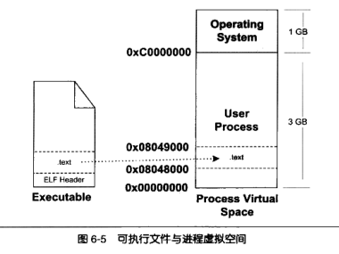



---


[toc]

---

### 静态链接

- 预处理 编译 汇编 链接
  - 预处理，展开# 
    - #define替换
    - #if #endif替换
    - 处理#include 递归替换
    - 删除注释
    - 添加行号和文件名标识
- 词法分析，语法分析，语义分析，中间语言生成
- 链接
  - 地址空间分配
  - 符号决议
  - 重定位


### 目标文件

- relocatable executable shared object

- 格式都一样，布局也一样，代码段数据段

  - .text  代码.data已经初始化的全局变量静态变量 .bss未初始化的全局变量静态变量
    -  ->二进制文件也可以强转成relocatable文件 objcopy
  - .plt .got跳转表/全局入口
  - strtab .debug .rodata .hash .line .dynamic
  - .init .fini 
  - 自定义段 `__attribute__((section("FOO")))`

  elf结构

  | ELF头                                                |
  | ---------------------------------------------------- |
  | .text                                                |
  | .data                                                |
  | .bss                                                 |
  | 其他段                                               |
  | section header table,段表 readelf查看 elf 头串起段表 |
  | string table <br>symbol table...                     |

  特殊符号`__executable_start` `__etext` `__edata`

  符号，name mangleing，extern “C”

  强符号，弱符号，默认强符号 `__attribute__((week))`

  强引用，弱引用，默认强引用 `__attribute__((weakref))` void foo 用来被覆盖

  弱符号典型代表，未初始化的全局变量

  

### 静态链接

- 相似段合并

  - 空间地址分配

    - elf专属地址，其他给个偏移

  - 符号解析重定位

    - 重定位表 object -r a.o
    - 链接需要符号表 readelf -s a.o
    - 链接器不感知类型信息，多个弱符号冲突如何处理？ common block ,一种符号提升手段。类似类型提升。
      - (gcc -fno-common, `__attribute__((nocommon))`)

  - c++相关的链接问题

    - 代码重复消除，模板和虚表造成的膨胀 linkonce段，多余的直接丢弃
    - 函数级别链接，提供接口让函数（或者参数）单独成段
    - 构造函数段和析构函数段
    - ABI问题
    - 静态链接 no-buildin -static --verbose 发生了什么

    

### 装载与动态链接

- 菜谱与炒菜

- overlay vs paging

  - paging 页映射

    - 创建独立虚拟地址空间

      - 分配一个页，给个页目录结束，不完整的页映射关系，等到页错误再配置

    - 执行文件头，建立虚拟空间与可执行文件的映射，准备照着菜谱炒菜

      - 可执行二进制文件又叫image懂了伐

      - VMA

        

    - 将CPU指令集设定成可执行文件入口地址，启动执行

  - 页错误

- ELF文件链接视图和执行视图

  - 不在乎段占用，段到底什么内容，只注意权限，相同权限合到一起映射 同一个VMA
  - 可执行文件会有程序表头 ProgramHeaderTable来保存映射的段信息(segment)

-  堆和栈也是VMA cat /proc/pid/maps

  - 可以看到和可执行文件映射vma不同，没有名字 aka AVMA anonymoout virtual memory area
  - 类似堆和栈，vdso 内核交互vma

- 总结四中VMA类型

  |          | 读   | 写   | 执行 | 映像文件                 |
  | -------- | ---- | ---- | ---- | ------------------------ |
  | 代码 VMA | √    | x    | √    | √                        |
  | 数据VMA  | √    | √    | √    | √                        |
  | 堆VMA    | √    | √    | √    | 匿名，无映像，可向上扩展 |
  | 栈       | √    | √    | x    | 匿名，无映像，可向下拓展 |

-  内核装载ELF的优化
  - 直接为0，bss不映射扔到堆里
- 段地址对齐以及优化
  - 碎片浪费 ->共享物理页，映射多次
- 进程栈初始化
- 内核装载ELF过程简介
  - exec -> sysexec ->do_exec
    - magic number判断开始解释执行 ->binnary_handle -> load_elf_binary
      - elf有效性
      - .interp段存在否,设置动态链接库路径
      - elf文件映射
      - 初始化elf进程环境
      - 系统调用返回地址改成elf可执行文件的入口点 e_entry
      - eip寄存器调到elf程序入口地址，开始执行


### 动态链接

- 静态链接磁盘一份内存一份造成的浪费

  - gcc -fPIC -shared -o xx.so xx.c

- 动态链接程序运行时地址分布

  - 代码段多出来libc ld和动态库

  - 装载时重定位以及地址无关代码PIC

    - 装载时重定位和链接时重定位差不多，没有重复利用代码。引入地址无关PIC可以重复使用，即尽量让地址相关的代码放到数据段

      - 代码段复用，数据段各自复制

        - 模块内部调用，相对地址调用，无需重定位

        - 模块内部数据访问，拿到PC (内部hack)+ 记录的偏移量

          ```asm
          call 484 <__i686.get_pc_thunk.cx>
          add $0x118c, %ecx
          movl $0x1, 0x28(%ecx)
          ```

          

        - 模块间数据访问，数据段中建立全局偏移表。间接引用

        - 模块间调用 也是全局偏移表，保存目标函数地址 存在性能问题。elf有优化

          ```asm
          call 484 <__i686.get_pc_thunk.cx>
          add $0x118c, %ecx
          mov 0xfffffffc(%ecx), %eax
          call *(%eax)
          ```

      - 全局变量怎么处理
        - 可执行文件bss段创建库的全局变量副本 加一条mov来访问
      - 数据段地址无关性

      

- 延迟绑定PLT

  - 调用时再绑定（这种理念到处都有啊原来）

    - `_dl_runtime_rosolve()`

    ```asm
    bar@plt:
    jmp *(bar@GOT)
    push n
    push moduleID
    jump _dl_runtime_resolve
    ```

  - 从`.got`段里拆出来。`.got.plt`段

    - `.dynamic`地址
    - 本模块id
    - `_dl_runtime_resolve`地址

- 动态链接相关结构

  - 引入动态链接器
    - `.interp`段，专门记录ld目录，字符串
    - `.dynamic` 导出符号表 `.hash` 加速查找
    -  重定位 `.rel.dyn  ` `.rel.plt ` 
  - 动态链接的步骤和实现
    - 动态链接器自举，本身也是动态链接库，需要自举完成状态切换，自举不能访问全局变量调用函数 ,因为没有重定位。`.dynamic`是入口点
    - 装载共享文件，合并全局符号表
      - 共享库符号冲突？后加入无效
    - 动态链接库的实现
      - 不仅是动态库，还是可执行文件
      - 内核执行不在乎是`ET_EXEC`还是`ET_DYN`，就是装载然后转移给ELF入口
        - `e_entry`, `.interp`
        - 就elf头不一样，扩展名不一样，其他都一样，window dll和exe也是类似的，`rundll32.exe`可以吧dll强行按照可执行文件执行
      - `_dl_start -> boostrap -> _dl_start_final -> _dl_sysdep_start -> _dl_main _dl_main`本身来判断自己是ld还是其他
      - 几点思考
        - 动态链接器本身是动态链接还是静态链接？ldd一下就知道了
        - 动态链接库本身是不是PIC？不是PIC的话，代码段需要重定位，没意义。
        - 动态链接库可以当做可执行文件执行，那么装载地址是？和其他动态库没区别

- 显示运行时链接

  - 灵活注入动态库。
  - `dlopen, dlsym dlerror dlclose`
    - `dlopen`
      1. 查找`LD_LIBRARY_PATH`
      2. 查找`/etc/ld.so.cache`
      3. `/lib` `/usr/lib` 
      4.  返回handle，如果filename为空返回全局符号表
      5. 会执行`.init`
    - `dlsym` 根据dlopen返回的handle来查符号


### Linux共享库的组织

- 版本
  - 兼容性 尽量别用c++接口。ABI灾难
  - 命名规则 `libname.so.x.y.z `
    1. x重大变动，可能不兼容
    2. y增量升级，新增接口
    3. z发布版本号，bugfix，改进等等
  - SO-NAME
    1. 只保留朱版本号的软连
       - 由于历史原因 `libc.so.2.6.1 -> libc.so.6` `ld.so.2.6.1 ->ld-linux.so`
    2. ldconfig
  - 符号版本, 比如glibc的 `GLIBC_2.6.1`，更新符号来保证依赖
- 共享库系统路径
  - `/lib` 系统关键库（动态链接器，c运行时，数学库，`bin` `sbin`用到的库）
  - `/usr/lib` 非系统运行时的关键共享库，静态库，目标文件。不会被用户用到
  - `/usr/local/lib` 第三方库，python解析器的lib，之类的
- 共享库的查找过程
  - `.dynamic`段中`DT_NEED`列出路径，如果是绝对路径，就会找这个文件，如果是相对路径，就会从`/lib` `/usr/lib` `/etc/ld.so.conf`配置文件指定的目录中查找
    - 每次查`/etc/ld.so.conf`必然很慢，ldconfig会cache一份`/etc/ld.so.cache`
    - 更改/etc/ld.so.conf需要运行`ldconfig` 重新cache一份

---

Any advice mailto:wanghenshui@qq.com, thanks! 

Pulling a [issue](https://github.com/wanghenshui/wanghenshui.github.io/issues/new) is fine! I can get noticed from email.

看到这里或许你有建议或者疑问或者指出我的错误，我的邮箱wanghenshui@qq.com 先谢指教。或者到博客上提[issue](https://github.com/wanghenshui/wanghenshui.github.io/issues/new) 我能收到邮件提醒。