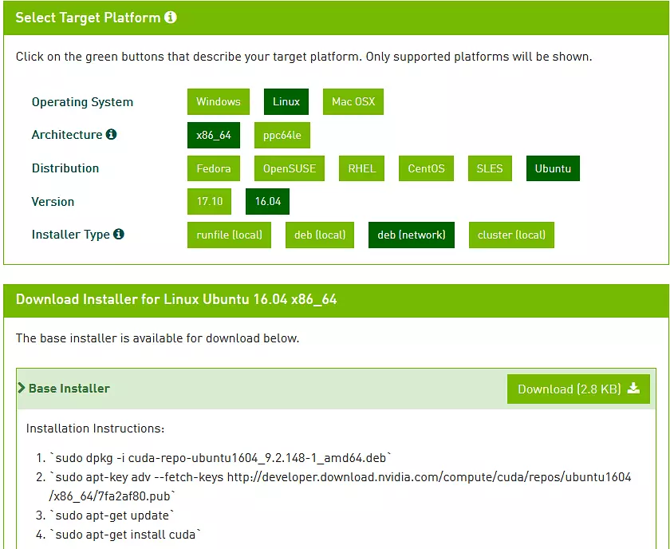
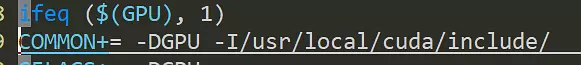
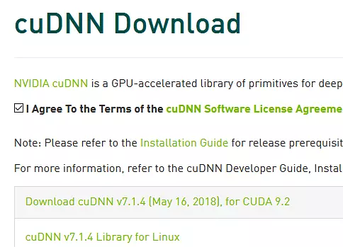

---

layout: post
title: 折腾了一下darknet
category: tools
tags: [c]
---



如果darknet要支持GPU和CUDNN的话，会有很多坑。

安装CUDA
两种方式，下载安装包和安装软件源

具体在https://developer.nvidia.com/cuda-downloads

我选的是网络安装deb




首先要下载deb文件，然后执行上面的步骤，cuda 就安装好了，默认在环境变量内。不用修改Makefile

如果是手动安装软件包，需要改动makefile 

COMMON需要改正安装的路径
安装结束后，需要注意修改nvcc路径，不在环境变量中可能会识别不到，改下路径


安装CUDNN
这个没有办法，不能用命令行

https://developer.nvidia.com/rdp/cudnn-download




点第一个就可以（需要注册）

```
tar -zxvf cudnn-9.2-linux-x64-v7.1.tgz
cp cuda/include/cudnn.h /usr/local/cuda/include/
cp cuda/lib64/* /usr/local/cuda/lib64/
```


然后编译就可以了


