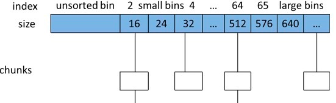



---

先说下glibc自带的ptmalloc

### 多线程支持

- Ptmalloc2有一个主分配区(main arena)， 有多个非主分配区。 非主分配区只能使用mmap向操作系统批发申请HEAP_MAX_SIZE（64位系统为64MB）大小的虚拟内存。 当某个线程调用malloc的时候，会先查看线程私有变量中是否已经存在一个分配区，如果存在则尝试加锁，如果加锁失败则遍历arena链表试图获取一个没加锁的arena， 如果依然获取不到则创建一个新的非主分配区。
- free()的时候也要获取锁。分配小块内存容易产生碎片，ptmalloc在整理合并的时候也要对arena做加锁操作。在线程多的时候，锁的开销就会增大。

### ptmalloc内存管理

- 用户请求分配的内存在ptmalloc中使用chunk表示， 每个chunk至少需要8个字节额外的开销。 用户free掉的内存不会马上归还操作系统，ptmalloc会统一管理heap和mmap区域的空闲chunk，避免了频繁的系统调用。

- ptmalloc 将相似大小的 chunk 用双向链表链接起来, 这样的一个链表被称为一个 bin。Ptmalloc 一共 维护了 128 个 bin,并使用一个数组来存储这些 bin(图就像二维数组，或者std::deque底层实现那种感觉，rocksdb arena实现也这样的)

  

  - 数组中的第一个为 unsorted bin, 数组中从 2 开始编号的前 64 个 bin 称为 small bins, 同一个small bin中的chunk具有相同的大小。small bins后面的bin被称作large bins。
  - 当free一个chunk并放入bin的时候， ptmalloc 还会检查它前后的 chunk 是否也是空闲的, 如果是的话,ptmalloc会首先把它们合并为一个大的 chunk, 然后将合并后的 chunk 放到 unstored bin 中。 另外ptmalloc 为了提高分配的速度,会把一些小的(不大于64B) chunk先放到一个叫做 fast bins 的容器内。
  - 在fast bins和bins都不能满足需求后，ptmalloc会设法在一个叫做top chunk的空间分配内存。 对于非主分配区会预先通过mmap分配一大块内存作为top chunk， 当bins和fast bins都不能满足分配需要的时候, ptmalloc会设法在top chunk中分出一块内存给用户, 如果top chunk本身不够大, 分配程序会重新mmap分配一块内存chunk, 并将 top chunk 迁移到新的chunk上，并用单链表链接起来。如果free()的chunk恰好 与 top chunk 相邻,那么这两个 chunk 就会合并成新的 top chunk，如果top chunk大小大于某个阈值才还给操作系统。主分配区类似，不过通过sbrk()分配和调整top chunk的大小，只有heap顶部连续内存空闲超过阈值的时候才能回收内存。
  - 需要分配的 chunk 足够大,而且 fast bins 和 bins 都不能满足要求,甚至 top chunk 本身也不能满足分配需求时,ptmalloc 会使用 mmap 来直接使用内存映射来将页映射到进程空间。

## ptmalloc的缺陷

- 后分配的内存先释放,因为 ptmalloc 收缩内存是从 top chunk 开始,如果与 top chunk 相邻的 chunk 不能释放, top chunk 以下的 chunk 都无法释放。
- 多线程锁开销大， 需要避免多线程频繁分配释放。
- 内存从thread的arena中分配， 内存不能从一个arena移动到另一个arena， 就是说如果多线程使用内存不均衡，容易导致内存的浪费。 比如说线程1使用了300M内存，完成任务后glibc没有释放给操作系统，线程2开始创建了一个新的arena， 但是线程1的300M却不能用了。
- 每个chunk至少8字节的开销很大
- 不定期分配长生命周期的内存容易造成内存碎片，不利于回收。 64位系统最好分配32M以上内存，这是使用mmap的阈值。

这里的问题在于arena是全局的 jemalloc和tcmalloc都针对这个做优化

tcmalloc的数据结构看参考链接

主要的优化 size分类

---

### Ref

- ptmalloc 原理，抄自这里<http://www.cnhalo.net/2016/06/13/memory-optimize/>
- 图解tcmalloc<https://zhuanlan.zhihu.com/p/29216091>

这里把搜集的一些资料列举一下，后续做整理

- 官网<http://jemalloc.net/>

- nedmalloc<https://www.nedprod.com/programs/portable/nedmalloc/>

- tcmalloc和jemalloc比较<https://stackoverflow.com/questions/7852731/c-memory-allocation-mechanism-performance-comparison-tcmalloc-vs-jemalloc>

  结论放这里

  > If I remember correctly, the main difference was with multi-threaded projects.
  >
  > Both libraries try to de-contention memory acquire by having threads pick the memory from different caches, but they have different strategies:
  >
  > - `jemalloc` (used by Facebook) maintains a cache per thread
  > - `tcmalloc` (from Google) maintains a pool of caches, and threads develop a "natural" affinity for a cache, but may change
  >
  > This led, once again if I remember correctly, to an important difference in term of thread management.
  >
  > - `jemalloc` is faster if threads are static, for example using pools
  > - `tcmalloc` is faster when threads are created/destructed
  >
  > There is also the problem that since `jemalloc` spin new caches to accommodate new thread ids, having a sudden spike of threads will leave you with (mostly) empty caches in the subsequent calm phase.
  >
  > As a result, I would recommend `tcmalloc` in the general case, and reserve `jemalloc` for very specific usages (low variation on the number of threads during the lifetime of the application)

- ruby使用各种malloc的benchmark，有点参考价值<http://engineering.appfolio.com/appfolio-engineering/2018/2/1/benchmarking-rubys-heap-malloc-tcmalloc-jemalloc>

- repo <https://github.com/jemalloc/jemalloc> wiki值得看下

- 一个使用例子 https://www.jianshu.com/p/5fd2b42cbf3d

- 这是另一个测试，不过HN上有人说测得不合理<http://ithare.com/testing-memory-allocators-ptmalloc2-tcmalloc-hoard-jemalloc-while-trying-to-simulate-real-world-loads/>

  - 反对的声音<https://news.ycombinator.com/item?id=17457699>
  - 测试的脚本和程序<https://github.com/node-dot-cpp/alloc-test>

- jemalloc设计者的博客，很多文章。是个狠人<http://branchtaken.net/blog/2008/07/25/treaps-versus-red-black-trees.html>

- glibc malloc的调优文档<https://www.gnu.org/software/libc/manual/html_node/Memory-Allocation-Tunables.html>

- 理解glibc malloc <https://sploitfun.wordpress.com/2015/02/10/understanding-glibc-malloc/>

- <https://www.facebook.com/notes/facebook-engineering/scalable-memory-allocation-using-jemalloc/480222803919>

- 论文<https://people.freebsd.org/~jasone/jemalloc/bsdcan2006/jemalloc.pdf>

- malloc 概论 必读<http://blog.reverberate.org/2009/02/one-malloc-to-rule-them-all.html>

### contact

Any advice mailto:wanghenshui@qq.com, thanks! 

Pulling a [issue](https://github.com/wanghenshui/wanghenshui.github.io/issues/new) is fine! I can get noticed from email.

看到这里或许你有建议或者疑问或者指出我的错误，我的邮箱wanghenshui@qq.com 先谢指教。或者到博客上提[issue](https://github.com/wanghenshui/wanghenshui.github.io/issues/new) 我能收到邮件提醒。